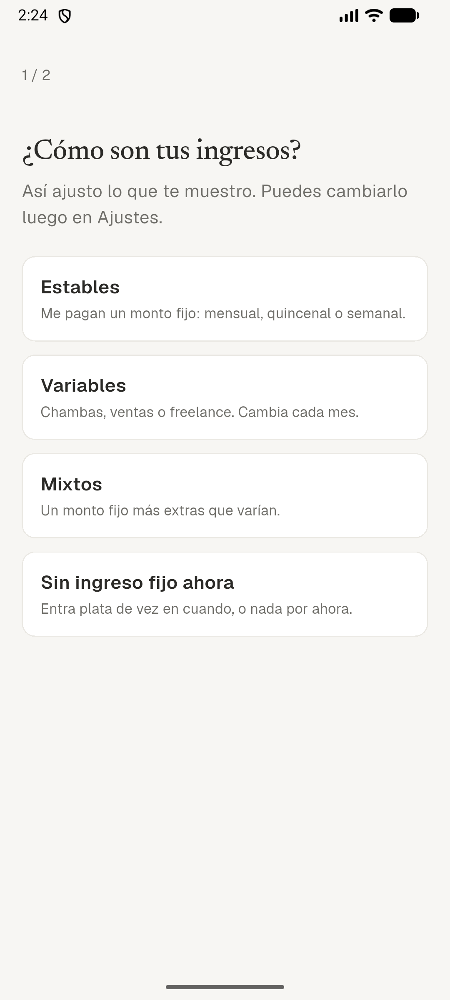
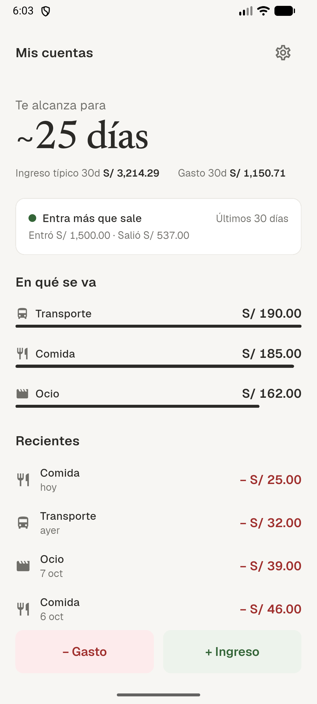
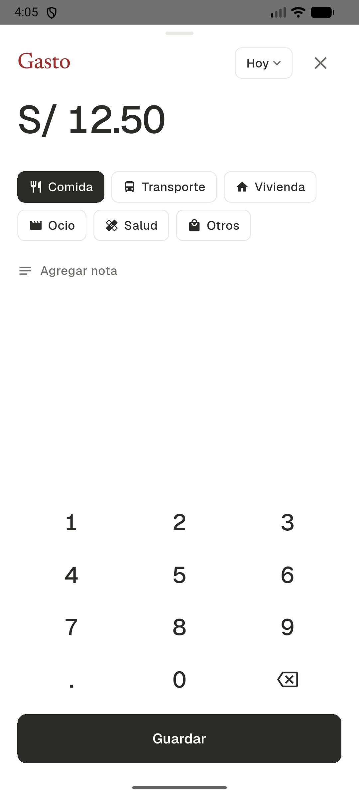

# SaldoClaro

App de finanzas personales para Android que responde dos preguntas:
**¿en qué se me va la plata?** y **¿me va a alcanzar?**

Está pensada para quien no tiene un ingreso fijo: freelancers, gente con
ingresos variables o que hoy vive de entradas sueltas. Funciona desde el día 1
con solo gastos, sin pedir sueldo ni día de pago, y calcula cuántos días te
alcanza la plata con tu ritmo de gasto real.

Todo se guarda en el teléfono. No hay login, ni servidor, ni conexión a internet.

## Pantallas

| Onboarding | Home | Registro |
|---|---|---|
|  |  |  |

- **Onboarding de 2 pasos:** elige cómo son tus ingresos (Estables, Variables,
  Mixtos o Sin ingreso fijo) y, si quieres, un nombre. No pide montos.
- **Home adaptativo por modo:**
  - Estable: cuánto te queda del presupuesto del mes;
  - Variable: cuántos días te alcanza, con ingreso típico y gasto de 30 días;
  - Supervivencia: cuántos días te alcanza y cuánto gastas al día.

  Además: semáforo de entradas y salidas, en qué se va la plata y movimientos
  recientes con Deshacer.
- **Registro en 2 toques:** teclado propio, categoría o fuente preseleccionada
  y borrador que sobrevive si cierras la app.
- **Ajustes:** modo, nombre, saldo inicial, ventana del cálculo, categorías y
  fuentes, exportación a CSV (lista para Excel en Perú).

Más capturas, en claro y oscuro, en [`docs/screenshots/`](docs/screenshots/).

## Stack

- **Flutter** (stable) + **Riverpod** para el estado.
- **drift** (SQLite) para la persistencia local, con streams reactivos: el Home
  se recalcula solo al guardar.
- **Sin dependencias de red.** Las fuentes Newsreader y Geist van como asset
  (licencia OFL).
- Las métricas (runway, promedios, semáforo, presupuesto) son funciones puras
  en `lib/domain/metrics.dart`, escritas con TDD. El dinero se maneja siempre
  en centavos enteros.

## Cómo compilar

```bash
flutter pub get
dart run build_runner build   # genera lib/data/database.g.dart (drift)
flutter run
```

```bash
flutter test      # suite completa
flutter analyze
```

En Windows, `flutter pub get` pide activar el Modo de desarrollador
(`start ms-settings:developers`).

## Estado

- **Fase 1b completa** (`fase-1b-completa`): Onboarding, Home, registro, saldo
  inicial y Ajustes.
- **Fase 1c en progreso:** Presupuesto e Insights.
- Después: legal y canal cerrado de testers (Fase 2), sync opcional con
  Supabase (Fase 3) y captura de notificaciones como experimento (Fase 4,
  código archivado en `lib/features/capture/`).

El detalle de producto, fórmulas y decisiones está en [`SPEC.md`](SPEC.md). El
plan de trabajo, en [`tasks/todo.md`](tasks/todo.md).
